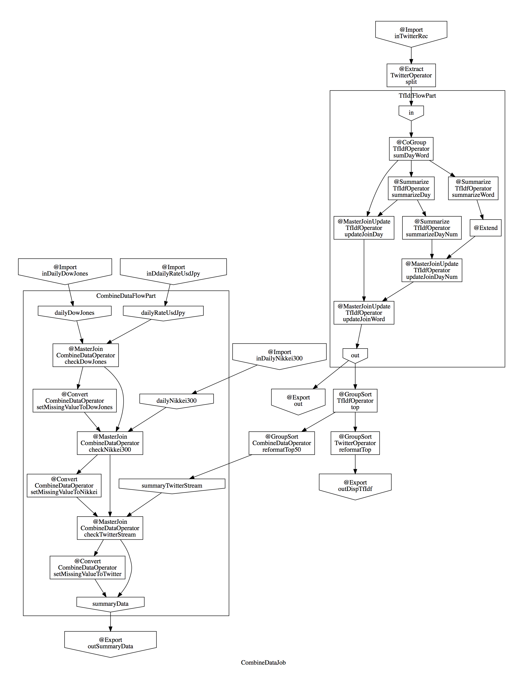

# AsakusaProject
## データ配置
```sh
# 実行サーバ
export TARGET_HOST=52.243.39.179
# データを配置するディレクトリを予め作成。
ssh nakazawa@${TARGET_HOST}
mkdir -p ~/target/testing/directio/daily_rate_usd_jpy
mkdir -p ~/target/testing/directio/daily_daw_jones
mkdir -p ~/target/testing/directio/daily_nikkei_300
mkdir -p ~/target/testing/directio/twitter
logout
# ローカルのデータ格納ディレクトリへ移動
cd ~/Downloads/nikkei_for_asakusa
scp USD_JPY_for_asakusa.csv nakazawa@${TARGET_HOST}:target/testing/directio/daily_rate_usd_jpy/
scp Dow_Jones_for_asakusa.csv nakazawa@${TARGET_HOST}:target/testing/directio/daily_daw_jones/
scp nikkei_for_asakusa.csv nakazawa@${TARGET_HOST}:target/testing/directio/daily_nikkei_300/
scp Tweet.txt nakazawa@${TARGET_HOST}:target/testing/directio/twitter/
```
## ビルド＆デプロイ
### eclipse使用
1. Jinrikisha（人力車）->Asakusaバッチアプリケーションを生成
2. Jinrikisha（人力車）->Asakusaバッチアプリケーションを生成->Asakusa開発環境の構成->バッチアプリケーションの配備

この手順で${ASAKUSA_HOME}以下に配備されます。

### shellコマンド（例：M3BP）
```sh
# プロジェクトディレクトリへ移動
cd ~/AsakusaProject/
./gradlew m3bpCompileBatchapps
./gradlew assemble
# デプロイ
cd ${ASAKUSA_HOME}
tar -xzf ~/mhir/wks/AsakusaProject/build/asakusafw-AsakusaProject.tar.gz
java -jar ${ASAKUSA_HOME}/tools/bin/setup.jar

```


## 実行
```sh
${ASAKUSA_HOME}/yaess/bin/yaess-batch.sh m3bp.CombineBatch
```
## 実行ステータス参照
Ambari WebUI: http://TARGET_HOEST:8080
Resource Manager WebUI: http://TARGET_HOEST:8088
Spark HistorySever: http://TARGET_HOEST:18081/

## 結果データ

日別データ
~/target/testing/directio/result/summary/summary_data.csv

## 中間データ
日別単語別計算結果詳細
~/target/testing/directio/result/daywordcount/dwcm-{日付}.csv

日別特徴単語（TF-IDF）
~/target/testing/directio/result/disptfidf/disptfidf.csv



