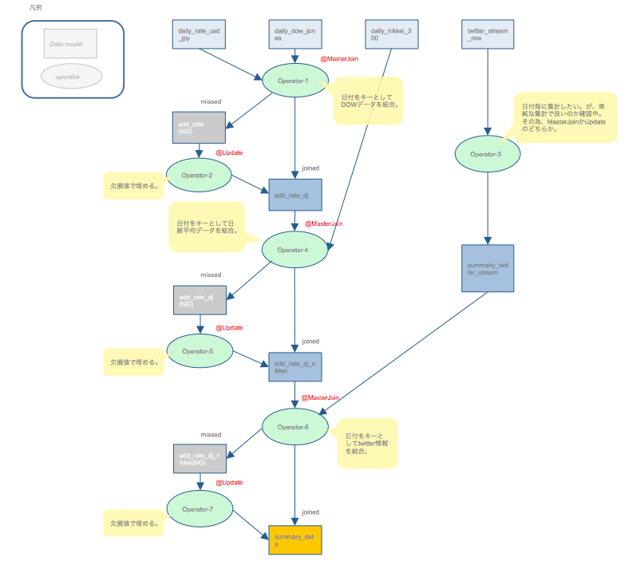

# AsakusaProject
## ビルド＆デプロイ
### eclipse使用
1. Jinrikisha（人力車）->Asakusaバッチアプリケーションを生成
2. Jinrikisha（人力車）->Asakusaバッチアプリケーションを生成->Asakusa開発環境の構成->バッチアプリケーションの配備

この手順で${ASAKUSA_HOME}以下に配備されます。

### shellコマンド
```sh
cd ~/${ASAKUSA_HOME}
tar -xzf ~/TwTfIdf/build//asakusafw-TwTfIdf.tar.gz
java -jar ${ASAKUSA_HOME}/tools/bin/setup.jar
```

## データ配置
```sh
cp {Twitter取得データ} ${ASAKUSA_HOME}/target/testing/directio/twitter/
```

## 実行

```sh
${ASAKUSA_HOME}/yaess/bin/yaess-batch.sh vanilla.TwTfIdfBatch
```

## 結果データ

日別トップ１００
~/target/testing/directio/result/disptfidf/disptfidf.csv

計算結果詳細
~/target/testing/directio/result/daywordcount/dwcm-{日付}.csv


